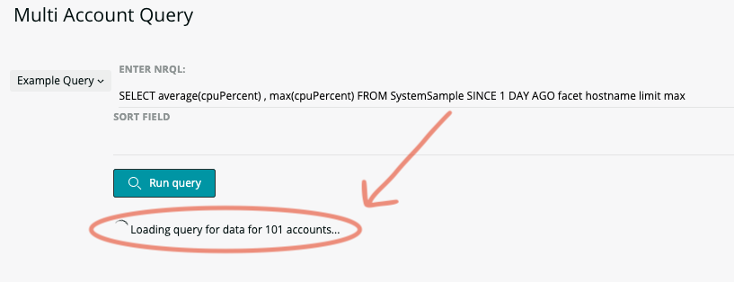

[](https://github.com/newrelic/open-source-office/blob/master/examples/categories/index.md#category-new-relic-experimental)

# New Relic One Multi-Account Query Tool (nr1-multi-account-query)

  [](https://snyk.io/test/github/newrelic-experimental/nr1-multi-account-query)

This application allows you to write an NRQL query which is run on all your sub accounts and collated into a single result set table. You can also specify pre-defined queries to make common queries easy to use.

It incorporates a [custom component](components/AccountrNRQL/index.js) that automates the batching of queries to the NerdGraph API which can be used seperately in your own projects.





## Configuration

- Configure the [config.json](config.json) with your account ID

The application stores configuration using NerdStorage so you must specify your New Relic account ID in the [config.json](config.json). Everything else is managed within the application.


## Date/Time formatting
Some fields return unix timestamps. To format these into more readable values specify the format you require in the 'as' label. To do this suffix you label with `|DATE:your-date-format-here`.

e.g:
```
select earliest(timestamp) as 'earliest|DATE:YYYY-MM-DD hh:mm', latest(timestamp) as 'latest|DATE:Do MMMM YYYY h:mm a' from Transaction 
```
Date formating strings should be specified as per the [momentjs documentation](https://momentjs.com/docs/#/displaying/format/)


